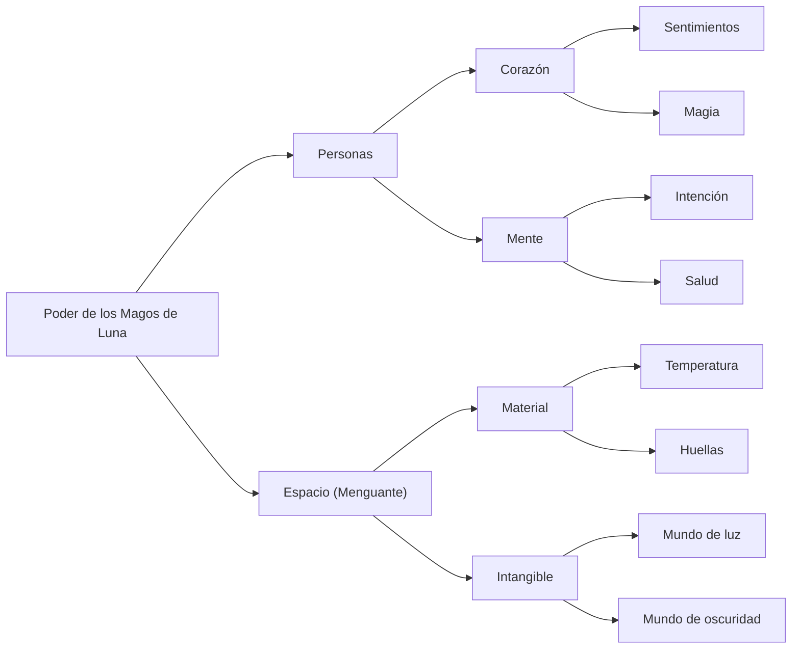

```mermaid

graph LR
    PML[Poder de los Magos de Luna] --> PER[Personas]
    PML --> ESP["Espacio (Menguante)"]

    %% Rama Personas
    PER --> COR[Corazón]
    COR --> COR1[Sentimientos]
    COR --> COR2[Magia]
    
    PER --> MEN[Mente]
    MEN --> MEN1[Intención]
    MEN --> MEN2[Salud]

    %% Rama Espacio
    ESP --> MAT[Material]
    MAT --> MAT1[Temperatura]
    MAT --> MAT2[Huellas]
    
    ESP --> INT[Intangible]
    INT --> INT1[Mundo de luz]
    INT --> INT2[Mundo de oscuridad]

```